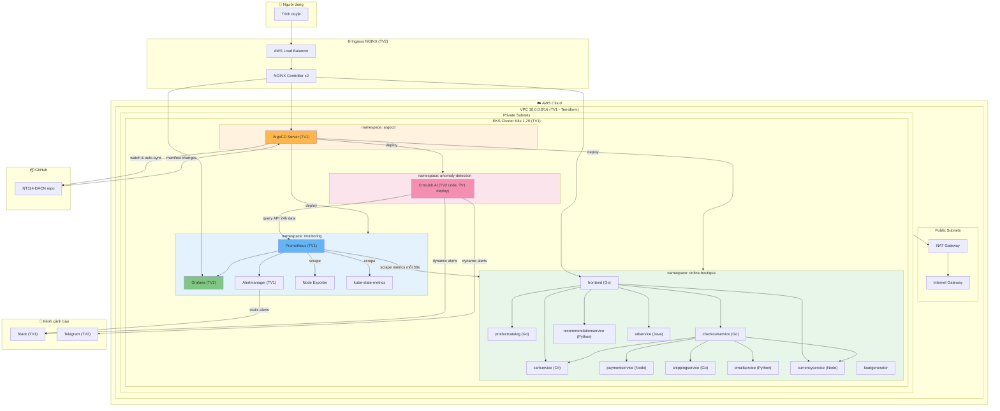
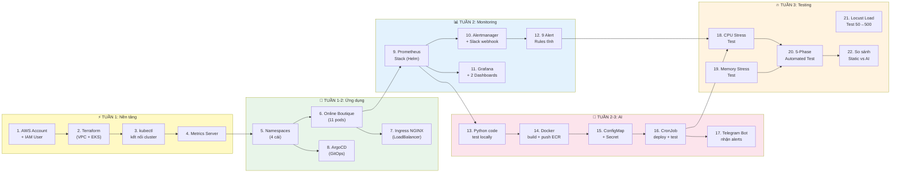
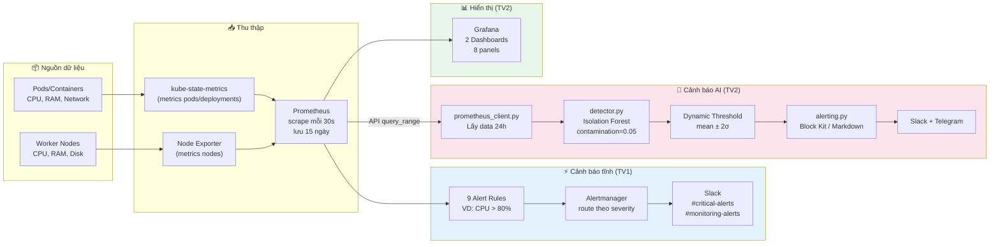

# 📋 KẾ HOẠCH CHI TIẾT  — NT114-DACN
## 🎯 HIỂU ĐỒ ÁN 

**Đồ án này làm gì?**  
Xây dựng 1 hệ thống hoàn chỉnh trên AWS, gồm:
1. **Hạ tầng cloud** (VPC, EKS cluster) — dùng Terraform tạo tự động
2. **Ứng dụng microservices** (Online Boutique của Google) — 11 services chạy trên Kubernetes
3. **GitOps** (ArgoCD) — thay đổi code trên Git → tự động deploy, không cần chạy tay
4. **Giám sát** (Prometheus + Grafana) — thu thập metrics, hiển thị dashboard đẹp
5. **Cảnh báo tĩnh** (Alertmanager) — CPU > 80% → gửi Slack, giống đặt chuông báo cố định
6. **Cảnh báo thông minh AI** (Isolation Forest) — tự học pattern bình thường, phát hiện bất thường tự động
7. **Kiểm thử** (Chaos + Load testing) — ép CPU/RAM, bắn 500 users để test hệ thống

**2 người chia nhau thế nào?**
- 🔵 **TV1 (Hạ tầng & DevOps):** Terraform, EKS, ArgoCD, Prometheus, Alertmanager, Chaos testing
- 🟢 **TV2 (App, Monitoring & AI):** Online Boutique, Ingress, Grafana, Python AI code, Load testing

**Tin tốt:** Tất cả 43 file code đã được viết sẵn. Việc còn lại là **hiểu**, **review**, **chạy**, **chỉnh sửa nếu cần**, và **viết báo cáo**.

---

## 🏗️ SƠ ĐỒ KIẾN TRÚC HỆ THỐNG

### Sơ đồ tổng thể — Tất cả thành phần và kết nối



### Thứ tự xây dựng — Cái nào phải làm trước cái nào



> [!IMPORTANT]
> **Phải làm theo thứ tự!** Không thể cài Prometheus (bước 9) nếu chưa có EKS cluster (bước 2). Không thể test AI (bước 13) nếu chưa có Prometheus (bước 9).

### Luồng dữ liệu giám sát — Dữ liệu chạy từ đâu đến đâu



---

## 📖🔧 PHÂN CHIA: LÝ THUYẾT vs THỰC HÀNH

> **📖 = Lý thuyết** (nghiên cứu, tìm hiểu, viết báo cáo — làm trên Word/Google Docs)
> **🔧 = Thực hành** (gõ lệnh, chạy code, cấu hình — làm trên terminal/IDE)

### Tuần 1 — Hạ tầng & Ứng dụng

| # | Việc | Loại | Ai | Chi tiết |
|---|------|------|-----|---------|
| 1 | Tìm hiểu AWS, VPC, EKS là gì | 📖 Lý thuyết | 🔵 TV1 | Đọc docs AWS, hiểu VPC = mạng ảo, EKS = Kubernetes managed |
| 2 | Tìm hiểu Terraform, IaC là gì | 📖 Lý thuyết | 🔵 TV1 | Đọc terraform.io/intro, hiểu: viết .tf → plan → apply |
| 3 | Cài 7 tools | 🔧 Thực hành | Cả 2 | AWS CLI, Terraform, kubectl, Helm, Docker, Python, Git |
| 4 | Tạo AWS account + IAM user | 🔧 Thực hành | 🔵 TV1 | Console → IAM → tạo user + access key |
| 5 | Chạy Terraform (tạo hạ tầng) | 🔧 Thực hành | 🔵 TV1 | `terraform init → plan → apply` (~20 phút) |
| 6 | Kết nối kubectl | 🔧 Thực hành | 🔵 TV1 | `aws eks update-kubeconfig`, `kubectl get nodes` |
| 7 | Nghiên cứu Kubernetes concepts | 📖 Lý thuyết | 🟢 TV2 | Pod, Service, Deployment, Namespace, kubectl |
| 8 | Nghiên cứu Microservices architecture | 📖 Lý thuyết | 🟢 TV2 | So sánh monolith vs microservices, gRPC vs REST |
| 9 | Nghiên cứu Google Online Boutique | 📖 Lý thuyết | 🟢 TV2 | 11 services, ngôn ngữ, giao tiếp → viết vào Chương 2 |
| 10 | Viết Chương 1 (Giới thiệu) | 📖 Lý thuyết | 🟢 TV2 | Đặt vấn đề, mục tiêu, phạm vi, phương pháp |
| 11 | Viết Chương 2 (Cơ sở lý thuyết) | 📖 Lý thuyết | 🟢 TV2 | K8s, Microservices, GitOps, Observability |
| 12 | Tạo 4 namespaces | 🔧 Thực hành | 🟢 TV2 | `kubectl apply -f namespaces.yaml` |
| 13 | Deploy Online Boutique | 🔧 Thực hành | 🟢 TV2 | `kubectl apply -k`, kiểm tra 11 pods Running |
| 14 | Cài Ingress NGINX (Helm) | 🔧 Thực hành | 🟢 TV2 | `helm install`, apply ingress rules |
| 15 | Tìm hiểu GitOps, ArgoCD là gì | 📖 Lý thuyết | 🔵 TV1 | GitOps = Git là single source of truth |
| 16 | Cài ArgoCD + 3 Applications | 🔧 Thực hành | 🔵 TV1 | Chạy `install.sh`, apply 3 YAML apps |

### Tuần 2 — Monitoring & AI

| # | Việc | Loại | Ai | Chi tiết |
|---|------|------|-----|---------|
| 17 | Tìm hiểu Prometheus architecture | 📖 Lý thuyết | 🔵 TV1 | Scrape model, TSDB, PromQL query language |
| 18 | Tìm hiểu Alertmanager routing | 📖 Lý thuyết | 🔵 TV1 | Routes, receivers, inhibit rules, severity levels |
| 19 | Cài Prometheus Stack (Helm) | 🔧 Thực hành | 🔵 TV1 | Chạy `install.sh`, kiểm tra pods monitoring |
| 20 | Tạo Slack workspace + webhook | 🔧 Thực hành | 🔵 TV1 | slack.com → Incoming Webhook → lấy URL |
| 21 | Cấu hình Alertmanager + apply | 🔧 Thực hành | 🔵 TV1 | Sửa YAML thay webhook URL → kubectl apply |
| 22 | Apply 9 alert rules | 🔧 Thực hành | 🔵 TV1 | `kubectl apply -f alert-rules.yaml` |
| 23 | Tìm hiểu Grafana, PromQL | 📖 Lý thuyết | 🟢 TV2 | Dashboard panels, datasource, query editor |
| 24 | Import 2 Grafana dashboards | 🔧 Thực hành | 🟢 TV2 | Upload JSON, chọn datasource, kiểm tra panels |
| 25 | Tìm hiểu Isolation Forest algorithm | 📖 Lý thuyết | 🟢 TV2 | Unsupervised ML, contamination, anomaly score → Chương 2 |
| 26 | Tìm hiểu Dynamic Threshold (mean ± 2σ) | 📖 Lý thuyết | 🟢 TV2 | So sánh static threshold vs dynamic → Chương 2 |
| 27 | Đọc hiểu Python source code AI | 📖 Lý thuyết | 🟢 TV2 | 6 files: config → prometheus_client → detector → alerting → main |
| 28 | Test Python AI code locally | 🔧 Thực hành | 🟢 TV2 | venv, pip install, port-forward, `python -m src.main` |
| 29 | Build Docker image + push ECR | 🔧 Thực hành | 🟢 TV2 | `docker build`, `docker push`, sửa cronjob.yaml |
| 30 | Tạo Telegram Bot | 🔧 Thực hành | 🔵 TV1 | @BotFather → /newbot → lấy token + chat ID |
| 31 | Deploy CronJob + ConfigMap + Secret | 🔧 Thực hành | 🔵 TV1 | 3 kubectl apply, test job, xem logs |

### Tuần 3 — Testing & So sánh

| # | Việc | Loại | Ai | Chi tiết |
|---|------|------|-----|---------|
| 32 | Tìm hiểu Chaos Engineering | 📖 Lý thuyết | 🔵 TV1 | Netflix Chaos Monkey, mục đích, phương pháp → Chương 4 |
| 33 | Chạy CPU stress test | 🔧 Thực hành | 🔵 TV1 | `kubectl apply`, chụp Grafana, check Slack |
| 34 | Chạy Memory stress test | 🔧 Thực hành | 🔵 TV1 | `kubectl apply`, chụp Grafana, check alerts |
| 35 | Chạy 5-phase automated test | 🔧 Thực hành | 🔵 TV1 | `./run-chaos-test.sh`, chụp screenshot mỗi phase |
| 36 | Ghi bảng so sánh Static vs AI | 📖 Lý thuyết | 🔵 TV1 | Detection time, false positives, accuracy → Chương 4 |
| 37 | Tìm hiểu Load Testing (Locust) | 📖 Lý thuyết | 🟢 TV2 | User simulation, spawn rate, percentile → Chương 4 |
| 38 | Chạy Locust load test (50/200/500) | 🔧 Thực hành | 🟢 TV2 | `docker compose up`, chạy 3 kịch bản, export kết quả |
| 39 | Phân tích kết quả + AI accuracy | 📖 Lý thuyết | 🟢 TV2 | TP, FP, FN, so sánh 3 mức tải → viết nhận xét |
| 40 | Test GitOps workflow ArgoCD | 🔧 Thực hành | 🔵 TV1 | Sửa manifest → push → xem auto-sync |

### Tuần 4 — Báo cáo & Demo

| # | Việc | Loại | Ai | Chi tiết |
|---|------|------|-----|---------|
| 41 | Viết Chương 3 (Thiết kế hệ thống) | 📖 Lý thuyết | 🔵 TV1 | Kiến trúc, Terraform, ArgoCD, Prometheus flow |
| 42 | Viết Chương 5 (Kết luận) | 📖 Lý thuyết | 🔵 TV1 | Kết quả, hạn chế, hướng phát triển |
| 43 | Viết Chương 4 (Triển khai & Đánh giá) | 📖 Lý thuyết | 🟢 TV2 | Screenshots, bảng kết quả, nhận xét |
| 44 | Làm slide thuyết trình (~20 slides) | 📖 Lý thuyết | 🟢 TV2 | Tóm tắt + screenshots + demo plan |
| 45 | Cập nhật docs/ và README | 📖 Lý thuyết | Cả 2 | architecture.md, setup-guide.md |
| 46 | Tập demo sống | 🔧 Thực hành | Cả 2 | kubectl, Grafana, ArgoCD, chaos test, alerts |
| 47 | terraform destroy (sau nộp) | 🔧 Thực hành | 🔵 TV1 | Xóa hạ tầng AWS tránh tốn phí |

### Tổng kết phân chia

| | 📖 Lý thuyết | 🔧 Thực hành | Tổng |
|---|---|---|---|
| 🔵 **TV1** | 7 items | 13 items | **20 items** |
| 🟢 **TV2** | 10 items | 9 items | **19 items** |
| 🟡 **Chung** | 1 item | 4 items | **5 items** |

> TV1 thiên về **thực hành** (chạy Terraform, cài tools, deploy).
> TV2 thiên về **lý thuyết + viết báo cáo** (nghiên cứu, phân tích, viết chương).
> Cả hai đều có cả lý thuyết lẫn thực hành.

---

## 📅 LỊCH TRÌNH 4 TUẦN

| Tuần | Ngày | TV1 làm gì | TV2 làm gì | Kết quả cuối tuần |
|------|------|------------|------------|-------------------|
| **1** | 30/3 – 5/4 | Cài tools, tạo AWS, chạy Terraform, dựng EKS | Cài tools, nghiên cứu Online Boutique, viết Chương 1-2 | EKS cluster chạy, 2 nodes Ready |
| **2** | 6/4 – 12/4 | Cài ArgoCD, test GitOps, cài Prometheus | Deploy Online Boutique, Ingress, Grafana dashboards | App chạy, Grafana có data |
| **3** | 13/4 – 19/4 | Alert rules, Slack webhook, deploy AI CronJob | Test Python AI, build Docker, Telegram bot | AI detect anomaly, alert gửi |
| **4** | 20/4 – 26/4 | Chaos testing, so sánh kết quả, viết Chương 3-5 | Load testing, phân tích, viết Chương 4, làm slide | Nộp báo cáo + demo |

---

## 🔧 TUẦN 1: HẠ TẦNG & CHUẨN BỊ (30/3 – 5/4)

---

### NGÀY 1-2: CÀI ĐẶT TOOLS (Cả 2 người làm)

**Mục tiêu:** Cài đầy đủ tools trên máy để có thể bắt đầu làm việc.

#### Bước 1: Cài AWS CLI
**Đây là gì?** Tool để giao tiếp với Amazon Web Services từ terminal.
```
1. Vào https://docs.aws.amazon.com/cli/latest/userguide/install-cliv2-windows.html
2. Tải file .msi → cài đặt
3. Mở PowerShell, gõ: aws --version
   → Kỳ vọng: aws-cli/2.x.x ...
```

#### Bước 2: Cài Terraform
**Đây là gì?** Tool "Infrastructure as Code" — viết file mô tả hạ tầng, Terraform tự tạo trên AWS.
```
1. Vào https://developer.hashicorp.com/terraform/downloads
2. Tải bản Windows AMD64 → giải nén → copy terraform.exe vào C:\Windows
3. Mở PowerShell, gõ: terraform --version
   → Kỳ vọng: Terraform v1.x.x
```

#### Bước 3: Cài kubectl
**Đây là gì?** Tool quản lý Kubernetes cluster — xem pods, deploy app, xem logs.
```
1. Mở PowerShell (admin), chạy:
   curl.exe -LO "https://dl.k8s.io/release/v1.29.0/bin/windows/amd64/kubectl.exe"
   Move-Item .\kubectl.exe C:\Windows\kubectl.exe
2. Kiểm tra: kubectl version --client
   → Kỳ vọng: Client Version: v1.29.x
```

#### Bước 4: Cài Helm
**Đây là gì?** "Package manager" cho Kubernetes — giống npm/pip nhưng cho K8s apps.
```
1. Vào https://helm.sh/docs/intro/install/
2. Tải bản Windows → giải nén → copy helm.exe vào C:\Windows
3. Kiểm tra: helm version
   → Kỳ vọng: version.BuildInfo{Version:"v3.x.x"...}
```

#### Bước 5: Cài Docker Desktop
**Đây là gì?** Chạy containers — đóng gói app thành image để deploy lên K8s.
```
1. Vào https://www.docker.com/products/docker-desktop/
2. Tải → cài đặt → khởi động lại máy
3. Mở Docker Desktop, đợi startup xong
4. Kiểm tra: docker --version
   → Kỳ vọng: Docker version 2x.x.x
```

#### Bước 6: Cài Python 3.11+
**Đây là gì?** Ngôn ngữ lập trình để viết module AI anomaly detection.
```
1. Vào https://www.python.org/downloads/
2. Tải Python 3.11+ → cài đặt → TICK "Add to PATH"
3. Kiểm tra: python --version
   → Kỳ vọng: Python 3.11.x
```

#### Bước 7: Cài Git
**Đây là gì?** Quản lý source code, làm việc nhóm.
```
1. Vào https://git-scm.com/download/win → tải → cài đặt
2. Kiểm tra: git --version
   → Kỳ vọng: git version 2.x.x
```

#### Bước 8: Clone repository
```bash
git clone https://github.com/hoangphuc6716/NT114-DACN.git
cd NT114-DACN
```

> **✅ Checklist ngày 1-2:** Cả 2 người đều chạy được 7 lệnh version check ở trên.

---

### NGÀY 2-3: TẠO AWS ACCOUNT & TRIỂN KHAI HẠ TẦNG (🔵 TV1)

**Mục tiêu:** Có 1 EKS cluster chạy trên AWS với 2 worker nodes.

#### Bước 1: Tạo AWS Account (nếu chưa có)
```
1. Vào https://aws.amazon.com/ → "Create an AWS Account"
2. Cần: email, số điện thoại, thẻ tín dụng (sẽ bị charge ~$5-10/ngày khi chạy EKS)
3. Chọn plan "Free Tier" (vẫn dùng được, chỉ EKS và NAT GW sẽ tốn tiền)
```

#### Bước 2: Tạo IAM User
**Tại sao?** Không nên dùng root account để làm việc — tạo 1 user riêng an toàn hơn.
```
1. Đăng nhập AWS Console → vào IAM
2. Users → Create User → tên: "nt114-admin"
3. Attach policy: "AdministratorAccess" → Create
4. Chọn user vừa tạo → Security Credentials → Create Access Key
5. Chọn "Command Line Interface (CLI)" → Create
6. GHI LẠI Access Key ID và Secret Access Key (chỉ hiện 1 lần!)
```

#### Bước 3: Cấu hình AWS CLI
```bash
aws configure
```
Khi được hỏi, nhập:
```
AWS Access Key ID: <paste Access Key từ bước trên>
AWS Secret Access Key: <paste Secret Key từ bước trên>
Default region name: ap-southeast-1
Default output format: json
```
Kiểm tra:
```bash
aws sts get-caller-identity
# Kỳ vọng: hiện Account ID, User ARN → nghĩa là kết nối OK
```

#### Bước 4: Chỉnh file biến Terraform
```bash
cd terraform
cp terraform.tfvars.example terraform.tfvars
```
Mở file `terraform.tfvars` — **KHÔNG CẦN SỬA GÌ** nếu dùng giá trị mặc định:
```hcl
aws_region   = "ap-southeast-1"     # Singapore, gần VN
project_name = "nt114-dacn"
environment  = "dev"
vpc_cidr             = "10.0.0.0/16"
availability_zones   = ["ap-southeast-1a", "ap-southeast-1b"]
private_subnet_cidrs = ["10.0.1.0/24", "10.0.2.0/24"]
public_subnet_cidrs  = ["10.0.101.0/24", "10.0.102.0/24"]
eks_cluster_version    = "1.29"
eks_node_instance_type = "t3.medium"   # 2 vCPU, 4GB RAM, ~$0.04/h
eks_node_desired_size  = 2              # 2 worker nodes
eks_node_min_size      = 1
eks_node_max_size      = 3
```

#### Bước 5: Chạy Terraform (tạo hạ tầng AWS)
```bash
# Bước 5a: Khởi tạo - tải plugins AWS, K8s
terraform init
# Kỳ vọng: "Terraform has been successfully initialized!"

# Bước 5b: Xem trước sẽ tạo những gì
terraform plan
# Kỳ vọng: "Plan: ~25 to add, 0 to change, 0 to destroy."
# Sẽ liệt kê: VPC, 4 subnets, IGW, NAT Gateway, EKS cluster, node group, IAM roles, SGs

# Bước 5c: TẠO THẬT (quan trọng nhất!)
terraform apply
# Gõ "yes" khi được hỏi
# ⏱ CHỜ 15-20 PHÚT — EKS cluster tạo rất lâu, đừng tắt terminal!
# Kỳ vọng cuối: "Apply complete! Resources: ... added"
```

**Nếu bị lỗi phổ biến:**
- `Error: error creating EKS Cluster: ResourceInUseException` → Cluster đã tồn tại, chạy `terraform destroy` trước
- `Error: insufficient capacity` → Thử đổi AZ trong `terraform.tfvars`
- `Error: not authorized` → Kiểm tra IAM user có policy AdministratorAccess

#### Bước 6: Kết nối kubectl tới EKS
```bash
aws eks update-kubeconfig --name nt114-dacn-dev --region ap-southeast-1
# Kỳ vọng: "Updated context arn:aws:eks:..."

kubectl get nodes
# Kỳ vọng:
# NAME                                          STATUS   ROLES    AGE   VERSION
# ip-10-0-1-xxx.ap-southeast-1.compute...       Ready    <none>   5m    v1.29.x
# ip-10-0-2-xxx.ap-southeast-1.compute...       Ready    <none>   5m    v1.29.x
```

#### Bước 7: Cài Metrics Server
```bash
kubectl apply -f https://github.com/kubernetes-sigs/metrics-server/releases/latest/download/components.yaml
# Đợi 1-2 phút
kubectl top nodes
# Kỳ vọng: hiện CPU/Memory usage của 2 nodes
```

> **✅ Checklist ngày 2-3 (TV1):** `kubectl get nodes` → 2 nodes Ready

---

### NGÀY 2-3: NGHIÊN CỨU & VIẾT TÀI LIỆU (🟢 TV2)

**Mục tiêu:** Hiểu Online Boutique là gì, viết draft Chương 1-2.

#### Bước 1: Nghiên cứu Google Online Boutique
```
1. Đọc repo: https://github.com/GoogleCloudPlatform/microservices-demo
2. Hiểu 11 microservices:
   - frontend (Go) — giao diện web
   - cartservice (C#) — quản lý giỏ hàng
   - productcatalogservice (Go) — danh mục sản phẩm
   - currencyservice (Node.js) — chuyển đổi tiền tệ
   - paymentservice (Node.js) — xử lý thanh toán
   - shippingservice (Go) — tính phí vận chuyển
   - emailservice (Python) — gửi email xác nhận
   - checkoutservice (Go) — xử lý checkout
   - recommendationservice (Python) — gợi ý sản phẩm
   - adservice (Java) — quảng cáo
   - loadgenerator (Python/Locust) — tạo traffic giả
3. Giao tiếp: hầu hết qua gRPC (nhanh hơn REST), frontend dùng HTTP
```

#### Bước 2: Viết Chương 1 — Giới thiệu
```
Nội dung gợi ý:
- 1.1 Đặt vấn đề: doanh nghiệp chuyển sang microservices, cần giám sát thông minh
- 1.2 Mục tiêu: xây dựng hệ thống GitOps + AI monitoring
- 1.3 Phạm vi: AWS EKS, Online Boutique, Prometheus, Grafana, Isolation Forest
- 1.4 Phương pháp: IaC (Terraform), GitOps (ArgoCD), ML (Isolation Forest)
```

#### Bước 3: Viết Chương 2 — Cơ sở lý thuyết
```
Nội dung gợi ý:
- 2.1 Kubernetes: pods, services, deployments, namespaces
- 2.2 Microservices architecture: so sánh với monolith
- 2.3 GitOps: khái niệm, ArgoCD, lợi ích
- 2.4 Observability: metrics, logs, traces — 3 pillars
- 2.5 Anomaly Detection: Isolation Forest algorithm, dynamic thresholds
```

#### Bước 4: Test kết nối cluster (khi TV1 làm xong)
TV1 chia sẻ kubeconfig cho TV2:
```bash
# TV1 chạy lệnh này, gửi output cho TV2
cat ~/.kube/config
# TV2 paste vào file ~/.kube/config của mình
# Sau đó test:
kubectl get nodes
```

> **✅ Checklist ngày 2-3 (TV2):** Hiểu 11 services, có draft Chương 1-2, `kubectl get nodes` chạy được

---

### NGÀY 4-5: DEPLOY ỨNG DỤNG & NAMESPACES (Cả 2 người)

---

#### 🟢 TV2: Deploy Online Boutique

**Bước 1: Tạo 4 namespaces**

**Namespace là gì?** Giống "thư mục" trong K8s — tách biệt các nhóm app, tránh conflict.

```bash
kubectl apply -f kubernetes/namespaces/namespaces.yaml
kubectl get ns
# Kỳ vọng: ngoài default, kube-system... sẽ thấy thêm:
#   anomaly-detection
#   argocd
#   monitoring
#   online-boutique
```

**Bước 2: Deploy Online Boutique (11 microservices)**

```bash
kubectl apply -k kubernetes/online-boutique/ -n online-boutique
# Đợi 3-5 phút cho các pods download images và start
kubectl get pods -n online-boutique -w    # -w = watch, auto refresh
# Kỳ vọng: 11 pods dần chuyển sang Running
# Ctrl+C để thoát watch
```

**Nếu pod bị lỗi:**
```bash
# Xem lý do lỗi:
kubectl describe pod <tên-pod> -n online-boutique
# Xem logs:
kubectl logs <tên-pod> -n online-boutique
```

**Bước 3: Test ứng dụng**
```bash
kubectl port-forward svc/frontend -n online-boutique 8080:80
# Mở browser → http://localhost:8080
# → Phải thấy trang web bán hàng Online Boutique!
# Ctrl+C để dừng port-forward
```

---

#### 🟢 TV2: Cài Ingress NGINX

**Ingress là gì?** Cổng vào duy nhất — thay vì mở nhiều port, dùng 1 LoadBalancer + domain names.

```bash
# Thêm Helm chart repo
helm repo add ingress-nginx https://kubernetes.github.io/ingress-nginx
helm repo update

# Cài đặt
helm install ingress-nginx ingress-nginx/ingress-nginx \
  --namespace ingress-nginx --create-namespace \
  -f kubernetes/ingress/ingress-nginx-values.yaml

# Kiểm tra
kubectl get pods -n ingress-nginx
# Kỳ vọng: 2 pods ingress-nginx-controller-xxx Running

kubectl get svc -n ingress-nginx
# Kỳ vọng: TYPE=LoadBalancer, có EXTERNAL-IP (hoặc hostname)
# GHI LẠI EXTERNAL-IP này!
```

**Apply Ingress rules:**
```bash
kubectl apply -f kubernetes/ingress/ingress.yaml
```

**Cấu hình hosts file (để test bằng domain name):**

Mở Notepad **as Admin** → mở file `C:\Windows\System32\drivers\etc\hosts`
Thêm dòng:
```
<EXTERNAL-IP>  shop.example.com  grafana.example.com  argocd.example.com
```

---

#### 🔵 TV1: Cài ArgoCD

**ArgoCD là gì?** Tool GitOps — nó theo dõi Git repo, khi có thay đổi manifest → tự động deploy lên K8s.

```bash
chmod +x argocd/install/install.sh
cd argocd/install
./install.sh
# ⏱ Chờ 2-5 phút
# Cuối script sẽ in:
#   Initial admin password: xxxxxxxxxxxx ← GHI LẠI!
cd ../..
```

**Apply ArgoCD Ingress:**
```bash
kubectl apply -f argocd/install/argocd-ingress.yaml
```

**Truy cập ArgoCD UI:**
```bash
# Cách 1: qua port-forward (chắc chắn hoạt động)
kubectl port-forward svc/argocd-server -n argocd 8443:443
# Mở browser → https://localhost:8443
# Login: admin / <password từ script>

# Cách 2: qua Ingress (nếu đã config hosts)
# → https://argocd.example.com
```

**Tạo ArgoCD Applications:**
```bash
kubectl apply -f argocd/applications/
# Tạo 3 applications: online-boutique, monitoring, anomaly-detection
```

> **✅ Checklist ngày 4-5:**
> - 11 pods Online Boutique Running
> - Truy cập được web qua http://localhost:8080
> - ArgoCD UI hiện 3 apps
> - Ingress Controller có External IP

---

## 🔧 TUẦN 2: MONITORING & AI (6/4 – 12/4)

---

### NGÀY 1-2: PROMETHEUS + ALERTMANAGER (🔵 TV1)

**Prometheus là gì?** Hệ thống thu thập metrics từ tất cả pods/nodes mỗi 15-30 giây.
**Alertmanager là gì?** Nhận alerts từ Prometheus, route tới Slack/email theo severity.

#### Bước 1: Cài Prometheus Stack

```bash
chmod +x monitoring/prometheus/install.sh
cd monitoring/prometheus
./install.sh
cd ../..
# ⏱ Chờ 5-10 phút
# Kỳ vọng cuối: "Prometheus Stack installed successfully"
```

Kiểm tra:
```bash
kubectl get pods -n monitoring
# Kỳ vọng: nhiều pods Running:
#   prometheus-prometheus-kube-prometheus-prometheus-0
#   prometheus-grafana-xxx
#   prometheus-kube-prometheus-operator-xxx
#   alertmanager-xxx
#   prometheus-kube-state-metrics-xxx
#   prometheus-prometheus-node-exporter-xxx (1 per node)
```

#### Bước 2: Tạo Slack Workspace & Webhook

```
1. Vào https://slack.com → "Create a Workspace"
2. Tạo workspace tên "NT114-DACN-Monitoring"
3. Tạo 2 channels: #monitoring-alerts, #critical-alerts
4. Vào https://api.slack.com/apps → "Create New App" → "From scratch"
5. Tên: "DACN Alertmanager" → chọn workspace
6. Sidebar → Features → Incoming Webhooks → Activate (On)
7. "Add New Webhook to Workspace" → chọn channel #monitoring-alerts
8. Copy Webhook URL (dạng: https://hooks.slack.com/services/T.../B.../xxx)
```

#### Bước 3: Cập nhật Alertmanager config

Mở file `monitoring/alertmanager/alertmanager-config.yaml`, tìm dòng:
```yaml
slack_api_url: 'https://hooks.slack.com/services/YOUR/SLACK/WEBHOOK'
```
Thay bằng Webhook URL thật từ bước trên.

Apply:
```bash
kubectl apply -f monitoring/alertmanager/alertmanager-config.yaml -n monitoring
```

#### Bước 4: Apply 9 Alert Rules

```bash
kubectl apply -f monitoring/alertmanager/alert-rules.yaml -n monitoring
```

Kiểm tra rules đã load:
```bash
kubectl port-forward svc/prometheus-kube-prometheus-prometheus -n monitoring 9090:9090
# Mở browser → http://localhost:9090/alerts
# Kỳ vọng: thấy 9 rules (NodeDown, HighNodeCPU, HighNodeMemory, ...)
```

---

### NGÀY 1-2: GRAFANA DASHBOARDS (🟢 TV2)

**Grafana là gì?** Dashboard đẹp — hiển thị biểu đồ CPU, RAM, request rate dạng real-time.

#### Bước 1: Truy cập Grafana

```bash
kubectl port-forward svc/prometheus-grafana -n monitoring 3000:80
# Mở browser → http://localhost:3000
# Login: admin / changeme-grafana-password
# (Grafana sẽ hỏi đổi password → đổi hoặc skip)
```

#### Bước 2: Kiểm tra Prometheus datasource

```
1. Sidebar → Connections → Data sources
2. Phải thấy "Prometheus" đã có sẵn (auto-configured)
3. Click vào → "Test" → "Data source is working"
```

#### Bước 3: Import Dashboard K8s Cluster Overview

```
1. Sidebar → Dashboards → "New" → "Import"
2. Click "Upload dashboard JSON file"
3. Chọn file: monitoring/grafana/dashboards/k8s-cluster-overview.json
4. Chọn datasource "Prometheus" → Import
5. Dashboard hiện ra với 4 panels:
   - Cluster CPU Usage (gauge/graph)
   - Cluster Memory Usage (gauge/graph)
   - Pod Count by Namespace (bar chart)
   - Node Status (table)
```

#### Bước 4: Import Dashboard Online Boutique

```
1. Lặp lại quy trình import
2. File: monitoring/grafana/dashboards/online-boutique-dashboard.json
3. Dashboard có 4 panels:
   - Request Rate (requests/sec)
   - Error Rate (errors/sec)
   - P99 Latency (milliseconds)
   - Pod Restart Count by Service
```

📸 **Chụp screenshot cả 2 dashboards** → dùng cho báo cáo Chương 3, 4.

---

### NGÀY 3-4: AI ANOMALY DETECTION (🟢 TV2 viết code, 🔵 TV1 deploy)

---

#### 🟢 TV2: Test Python AI code locally

**Code đã viết sẵn,** chỉ cần test.

**Bước 1: Tạo môi trường Python**
```bash
cd anomaly-detection
python -m venv venv
venv\Scripts\activate    # Windows
pip install -r requirements.txt
# Cài: requests, numpy, pandas, scikit-learn, prometheus-api-client, python-dotenv
```

**Bước 2: Hiểu luồng code AI**

Giải thích cho TV2 hiểu source code:

```
main.py ← Entry point
  ↓ Đọc 4 metrics từ config.py (cpu_usage, memory_usage, node_cpu, node_memory)
  ↓ Với mỗi metric:
      1. prometheus_client.py → Gọi API Prometheus, lấy data 24 giờ qua
         - fetch_metric_range(query) → trả về DataFrame (timestamp, value, labels)
      2. detector.py → Phân tích anomaly
         - Dùng Isolation Forest (thuật toán ML):
           + contamination=0.05 (giả sử 5% data là anomaly)
           + n_estimators=100 (100 cây quyết định)
         - Tính dynamic threshold: mean ± 2σ
         - Nếu giá trị mới nhất bị model đánh là -1 → anomaly!
      3. alerting.py → Gửi cảnh báo
         - Slack: Block Kit format (đẹp, có section, fields)
         - Telegram: Markdown format
```

**Bước 3: Test code (cần Prometheus đang chạy)**
```bash
# Terminal 1: port-forward Prometheus
kubectl port-forward svc/prometheus-kube-prometheus-prometheus -n monitoring 9090:9090

# Terminal 2: chạy AI code
cd anomaly-detection
venv\Scripts\activate
set PROMETHEUS_URL=http://localhost:9090
python -m src.main
```

Kỳ vọng output:
```
2026-03-xx ... - Starting anomaly detection pipeline...
2026-03-xx ... - Analyzing metric: cpu_usage - CPU Usage by Pod
2026-03-xx ... - Fetched 287 data points for query
2026-03-xx ... - Found 0 anomalies out of 15 label groups for cpu_usage
... (lặp lại cho 3 metrics còn lại)
2026-03-xx ... - No anomalies detected across all metrics
2026-03-xx ... - Anomaly detection pipeline completed
```

(Nếu hệ thống đang bình thường → "No anomalies" là đúng!)

---

#### 🟢 TV2: Build Docker Image

```bash
cd anomaly-detection
docker build -t anomaly-detection:latest .
# ⏱ 2-3 phút lần đầu

# Test chạy container:
docker run --rm \
  -e PROMETHEUS_URL=http://host.docker.internal:9090 \
  anomaly-detection:latest
# (cần port-forward đang chạy ở terminal khác)
```

**Push lên ECR (để K8s pull được):**
```bash
# Lấy Account ID
aws sts get-caller-identity --query Account --output text
# Ví dụ: 123456789012

# Tạo ECR repository
aws ecr create-repository --repository-name anomaly-detection --region ap-southeast-1

# Login Docker → ECR
aws ecr get-login-password --region ap-southeast-1 | docker login --username AWS --password-stdin 123456789012.dkr.ecr.ap-southeast-1.amazonaws.com

# Tag & Push
docker tag anomaly-detection:latest 123456789012.dkr.ecr.ap-southeast-1.amazonaws.com/anomaly-detection:latest
docker push 123456789012.dkr.ecr.ap-southeast-1.amazonaws.com/anomaly-detection:latest
```

**Quan trọng:** Sau khi push, mở file `anomaly-detection/k8s/cronjob.yaml` và sửa dòng:
```yaml
# Thay dòng này:
image: anomaly-detection:latest
# Thành:
image: 123456789012.dkr.ecr.ap-southeast-1.amazonaws.com/anomaly-detection:latest
```

---

#### 🔵 TV1: Cấu hình Slack & Telegram

**Slack (cho Alertmanager):** Đã làm ở bước trên.

**Telegram Bot (cho AI alerts):**
```
1. Mở Telegram → tìm @BotFather → chat
2. Gõ: /newbot
3. Đặt tên bot: "DACN Alert Bot"
4. Đặt username: dacn_alert_bot (phải kết thúc bằng _bot)
5. BotFather sẽ cho TOKEN (dạng: 123456:ABCdefGHI...)
6. Tạo group Telegram, thêm bot vào group
7. Gửi 1 tin nhắn bất kỳ trong group
8. Truy cập: https://api.telegram.org/bot<TOKEN>/getUpdates
9. Tìm "chat":{"id":-100xxxx...} → đó là CHAT_ID
```

#### 🔵 TV1: Deploy AI CronJob lên K8s

**Bước 1: Cập nhật Secret**

Mở file `anomaly-detection/k8s/secret.yaml`, thay placeholder:
```yaml
stringData:
  SLACK_WEBHOOK_URL: "https://hooks.slack.com/services/T.../B.../xxx"  # ← URL thật
  TELEGRAM_BOT_TOKEN: "123456:ABCdefGHI..."   # ← Token thật
  TELEGRAM_CHAT_ID: "-100xxxx"                 # ← Chat ID thật
```

**Bước 2: Apply lên cluster**
```bash
kubectl apply -f anomaly-detection/k8s/configmap.yaml
kubectl apply -f anomaly-detection/k8s/secret.yaml
kubectl apply -f anomaly-detection/k8s/cronjob.yaml
```

**Bước 3: Test chạy ngay (không đợi 15 phút)**
```bash
kubectl create job test-anomaly --from=cronjob/anomaly-detection -n anomaly-detection
# Đợi 1-2 phút
kubectl logs job/test-anomaly -n anomaly-detection
# Kỳ vọng: pipeline chạy, fetch metrics, analyze, completed
```

**Nếu lỗi ImagePullBackOff:**
```bash
kubectl describe pod <pod-name> -n anomaly-detection
# Thường do: image URL sai, hoặc node không có quyền pull từ ECR
# Fix: kiểm tra lại ECR URI trong cronjob.yaml
```

> **✅ Checklist cuối tuần 2:**
> - Prometheus chạy, 9 alert rules loaded
> - Grafana có 2 dashboards với data
> - AI CronJob chạy thành công (logs: "pipeline completed")
> - Slack/Telegram nhận được test alert (nếu có anomaly)

---

## 🔧 TUẦN 3: TESTING & SO SÁNH (13/4 – 19/4)

---

### NGÀY 1-3: CHAOS TESTING (🔵 TV1)

**Chaos testing là gì?** CỐ TÌNH phá hệ thống (ép CPU, RAM) để xem hệ thống giám sát có phát hiện không.

#### Bước 1: Chạy CPU Stress Test

```bash
kubectl apply -f chaos-testing/scripts/cpu-stress-test.yaml
# Tạo 1 pod stress CPU 4 cores trong 5 phút
```

**Trong khi stress đang chạy:**
1. Mở Grafana → K8s Cluster Overview → quan sát CPU spike
2. Mở Prometheus → http://localhost:9090/alerts → xem HighNodeCPU có firing không
3. Kiểm tra Slack → có nhận alert không?
4. Chờ AI CronJob chạy (mỗi 15 phút) → kiểm tra Telegram

📸 **Chụp screenshot Grafana** khi CPU spike!

```bash
# Xem job status:
kubectl get jobs -n online-boutique
# Đợi job hoàn thành (~5 phút), tự xóa sau 5 phút (ttlSecondsAfterFinished: 300)
```

#### Bước 2: Chạy Memory Stress Test

```bash
kubectl apply -f chaos-testing/scripts/memory-stress-test.yaml
# Tương tự → stress RAM 512MB trong 5 phút
```

📸 **Chụp screenshot Grafana** khi Memory spike!

#### Bước 3: Chạy Automated 5-Phase Test

```bash
chmod +x chaos-testing/scripts/run-chaos-test.sh
cd chaos-testing/scripts
./run-chaos-test.sh
cd ../..
# ⏱ Tổng: ~15-20 phút tự động
# Phase 1: Baseline (2 min) — metrics bình thường
# Phase 2: CPU stress (5 min) — ép CPU
# Phase 3: Recovery (2 min) — phục hồi
# Phase 4: Memory stress (5 min) — ép RAM
# Phase 5: Cleanup — dọn dẹp
```

📸 **Chụp screenshot Grafana ở MỖI phase** — rất quan trọng cho báo cáo!

#### Bước 4: Ghi bảng so sánh

| Tiêu chí | Static Alerts (Prometheus) | AI Dynamic Alerts (Isolation Forest) |
|----------|---------------------------|--------------------------------------|
| Thời gian phát hiện CPU spike | _? phút_ | _? phút_ |
| Thời gian phát hiện Memory spike | _? phút_ | _? phút_ |
| Số false positives | _?_ | _?_ |
| Số missed anomalies | _?_ | _?_ |
| Cách hoạt động | Ngưỡng cứng (CPU > 80%) | Tự học pattern + mean ± 2σ |

---

### NGÀY 2-4: LOAD TESTING (🟢 TV2)

**Load testing là gì?** Giả lập hàng trăm users truy cập cùng lúc → xem hệ thống chịu được không.

#### Bước 1: Sửa Host trong docker-compose

Mở `chaos-testing/locust/docker-compose.yaml`, tìm:
```yaml
command: -f /mnt/locust/locustfile.py --master -H http://shop.example.com
```
Nếu không dùng domain, thay `http://shop.example.com` bằng:
```
-H http://<EXTERNAL-IP-CỦA-INGRESS>
```

#### Bước 2: Chạy Locust

```bash
cd chaos-testing/locust
docker compose up -d
# Kỳ vọng: 1 master + 4 workers start
# Kiểm tra: docker compose ps → tất cả Up
```

Mở browser → **http://localhost:8089** → Locust Web UI

#### Bước 3: Chạy 3 kịch bản test

**Test 1 — Light (50 users):**
```
Number of users: 50
Spawn rate: 5
→ Click "Start swarming"
→ Chạy 5 phút → Click "Stop"
→ 📸 Chụp screenshot tab "Statistics" và "Charts"
```

**Test 2 — Medium (200 users):**
```
→ "New Test" → 200 users, spawn rate 10
→ Chạy 5 phút → Stop → 📸 Chụp screenshots
```

**Test 3 — Heavy (500 users):**
```
→ "New Test" → 500 users, spawn rate 20
→ Chạy 5 phút → Stop → 📸 Chụp screenshots
```

**Đồng thời:** Mở Grafana song song, chụp dashboard tại mỗi mức tải.

#### Bước 4: Thu thập kết quả

| Mức tải | Requests/s | Failure % | Median (ms) | P95 (ms) | P99 (ms) |
|---------|-----------|-----------|-------------|----------|----------|
| 50 users | _?_ | _?_ | _?_ | _?_ | _?_ |
| 200 users | _?_ | _?_ | _?_ | _?_ | _?_ |
| 500 users | _?_ | _?_ | _?_ | _?_ | _?_ |

```bash
# Dừng Locust
docker compose down
```

---

### NGÀY 4-5: PHÂN TÍCH KẾT QUẢ (🟢 TV2) + TEST GITOPS (🔵 TV1)

#### 🟢 TV2: Phân tích

1. So sánh metrics giữa 3 mức tải: response time tăng theo users?
2. Ở mức 500 users, có lỗi không (failure rate)?
3. AI có detect anomaly khi load test không? (check Telegram)
4. Tính accuracy:
   - **True Positive** = anomaly thật + AI phát hiện ✅
   - **False Positive** = bình thường + AI báo anomaly ❌
   - **False Negative** = anomaly thật + AI không phát hiện ❌

#### 🔵 TV1: Test GitOps workflow

```
1. Mở ArgoCD UI → thấy 3 apps "Synced"
2. Sửa 1 manifest bất kỳ (VD: thêm 1 label vào namespaces.yaml)
3. Commit & push lên GitHub
4. Quay lại ArgoCD UI → trong vòng 3 phút sẽ thấy "OutOfSync" → auto sync
5. 📸 Chụp screenshot TRƯỚC và SAU sync
```

> **✅ Checklist cuối tuần 3:**
> - Có 📸 screenshots Grafana khi chaos test (CPU spike, Memory spike)
> - Có 📸 screenshots Locust (3 mức tải)
> - Có bảng so sánh Static vs Dynamic alerts
> - Có kết quả Load test (bảng metrics)
> - ArgoCD GitOps hoạt động (có screenshot)

---

## 🔧 TUẦN 4: BÁO CÁO & DEMO (20/4 – 26/4)

---

### NGÀY 1-3: VIẾT BÁO CÁO

#### 🔵 TV1 viết:

**Chương 3 — Thiết kế hệ thống:**
```
Nội dung:
- 3.1 Kiến trúc tổng thể (dùng sơ đồ ASCII từ README)
- 3.2 Hạ tầng AWS (VPC, EKS, Security Groups — mô tả file Terraform)
- 3.3 GitOps workflow (ArgoCD auto-sync)
- 3.4 Prometheus Metrics Flow (scrape → store → alert)
- 3.5 Alertmanager routing (critical → Slack, warning → Slack)
  → Paste screenshots ArgoCD, Prometheus UI
```

**Chương 5 — Kết luận:**
```
- 5.1 Kết quả đạt được
- 5.2 Hạn chế
- 5.3 Hướng phát triển (6 hướng từ README: Deep Learning, CI/CD, Multi-cluster...)
```

#### 🟢 TV2 viết:

**Chương 4 — Triển khai & Đánh giá:**
```
Nội dung:
- 4.1 Triển khai Online Boutique (screenshot frontend)
- 4.2 Cấu hình Grafana dashboards (screenshot 2 dashboards)
- 4.3 AI Anomaly Detection (flow code, Isolation Forest params)
- 4.4 Kịch bản Chaos Testing (CPU stress, Memory stress — screenshot timeline)
- 4.5 Kịch bản Load Testing (50/200/500 users — bảng metrics)
- 4.6 Đánh giá: so sánh Static vs AI alerts (bảng + nhận xét)
  → Paste TẤT CẢ screenshots đã chụp
```

---

### NGÀY 3-4: LÀM SLIDE (🟢 TV2 chính, 🔵 TV1 review)

**~20 slides gợi ý:**

| Slide | Nội dung |
|-------|---------|
| 1 | Trang bìa (đề tài, tên nhóm, GVHD) |
| 2 | Mục lục |
| 3 | Đặt vấn đề & Mục tiêu |
| 4 | Kiến trúc tổng thể (sơ đồ) |
| 5 | Công nghệ sử dụng (AWS, EKS, Terraform, ArgoCD...) |
| 6 | Terraform — IaC (VPC, EKS) |
| 7 | ArgoCD — GitOps workflow |
| 8 | Online Boutique — 11 microservices |
| 9 | Prometheus — Metrics collection |
| 10 | Alertmanager — 9 static alert rules |
| 11 | Grafana — Dashboard screenshots |
| 12 | AI Module — Isolation Forest algorithm |
| 13 | AI Module — Code architecture (config → fetch → detect → alert) |
| 14 | Chaos Testing — CPU/Memory stress |
| 15 | Chaos Testing — Grafana screenshots (before/during/after) |
| 16 | Load Testing — Locust (50/200/500 users) |
| 17 | Kết quả so sánh — Static vs Dynamic alerts (bảng) |
| 18 | Demo sống (plan) |
| 19 | Kết luận & Hướng phát triển |
| 20 | Q&A |

---

### NGÀY 4-5: DEMO & NỘP

#### Chuẩn bị demo sống (cần EKS cluster đang chạy):

```
Demo flow (~5-7 phút):
1. Terminal: kubectl get nodes → "2 nodes Ready"
2. Terminal: kubectl get pods -n online-boutique → "11 pods Running"
3. Browser: mở Online Boutique → duyệt sản phẩm, add to cart
4. Browser: mở ArgoCD UI → 3 apps Synced
5. Browser: mở Grafana → show 2 dashboards
6. Terminal: kubectl apply -f chaos-testing/scripts/cpu-stress-test.yaml
7. Browser: Grafana → xem CPU spike real-time
8. Phone: show Slack/Telegram → nhận alert!
```

**Rehearsal:** Tập chạy demo 1-2 lần trước buổi nộp.

---

### SAU KHI NỘP: CLEANUP (🔵 TV1)

```bash
cd terraform
terraform destroy
# Gõ "yes" → ⏱ 10-15 phút
# Xóa toàn bộ VPC, EKS, NAT GW → DỪNG TỐN TIỀN AWS
```

Kiểm tra AWS Console → không còn resources chạy.

---

## 📊 BẢNG THEO DÕI TIẾN ĐỘ

Đánh dấu ✅ khi hoàn thành, ghi ngày hoàn thành.

### Tuần 1 (30/3 – 5/4)
| # | Việc | Người | Ngày xong | Status |
|---|------|-------|-----------|--------|
| 1 | Cài 7 tools (AWS CLI, Terraform, kubectl, Helm, Docker, Python, Git) | Cả 2 | | ⬜ |
| 2 | Tạo AWS account + IAM user | 🔵 TV1 | | ⬜ |
| 3 | Cấu hình AWS CLI | 🔵 TV1 | | ⬜ |
| 4 | Copy terraform.tfvars | 🔵 TV1 | | ⬜ |
| 5 | terraform init + plan + apply | 🔵 TV1 | | ⬜ |
| 6 | kubectl get nodes → 2 Ready | 🔵 TV1 | | ⬜ |
| 7 | Cài Metrics Server | 🔵 TV1 | | ⬜ |
| 8 | Nghiên cứu Online Boutique | 🟢 TV2 | | ⬜ |
| 9 | Viết draft Chương 1-2 | 🟢 TV2 | | ⬜ |
| 10 | Tạo 4 namespaces | 🟢 TV2 | | ⬜ |
| 11 | Deploy Online Boutique (11 pods) | 🟢 TV2 | | ⬜ |
| 12 | Cài Ingress NGINX Controller | 🟢 TV2 | | ⬜ |
| 13 | Cài ArgoCD + lấy password | 🔵 TV1 | | ⬜ |
| 14 | Tạo 3 ArgoCD Applications | 🔵 TV1 | | ⬜ |

### Tuần 2 (6/4 – 12/4)
| # | Việc | Người | Ngày xong | Status |
|---|------|-------|-----------|--------|
| 15 | Cài Prometheus stack (install.sh) | 🔵 TV1 | | ⬜ |
| 16 | Tạo Slack workspace + webhook | 🔵 TV1 | | ⬜ |
| 17 | Cập nhật alertmanager-config.yaml + apply | 🔵 TV1 | | ⬜ |
| 18 | Apply 9 alert rules | 🔵 TV1 | | ⬜ |
| 19 | Truy cập Grafana, import 2 dashboards | 🟢 TV2 | | ⬜ |
| 20 | Chụp screenshots dashboards | 🟢 TV2 | | ⬜ |
| 21 | Test Python AI code locally | 🟢 TV2 | | ⬜ |
| 22 | Build Docker image + push ECR | 🟢 TV2 | | ⬜ |
| 23 | Tạo Telegram bot + lấy token | 🔵 TV1 | | ⬜ |
| 24 | Cập nhật secret.yaml + apply | 🔵 TV1 | | ⬜ |
| 25 | Deploy CronJob + test | 🔵 TV1 | | ⬜ |

### Tuần 3 (13/4 – 19/4)
| # | Việc | Người | Ngày xong | Status |
|---|------|-------|-----------|--------|
| 26 | Chạy CPU stress test + chụp Grafana | 🔵 TV1 | | ⬜ |
| 27 | Chạy Memory stress test + chụp Grafana | 🔵 TV1 | | ⬜ |
| 28 | Chạy 5-phase chaos test | 🔵 TV1 | | ⬜ |
| 29 | Ghi bảng so sánh Static vs AI alerts | 🔵 TV1 | | ⬜ |
| 30 | Chạy Locust load test 50 users | 🟢 TV2 | | ⬜ |
| 31 | Chạy Locust load test 200 users | 🟢 TV2 | | ⬜ |
| 32 | Chạy Locust load test 500 users | 🟢 TV2 | | ⬜ |
| 33 | Thu thập bảng kết quả load test | 🟢 TV2 | | ⬜ |
| 34 | Test GitOps workflow (thay manifest → auto sync) | 🔵 TV1 | | ⬜ |
| 35 | Phân tích AI detection accuracy | 🟢 TV2 | | ⬜ |

### Tuần 4 (20/4 – 26/4)
| # | Việc | Người | Ngày xong | Status |
|---|------|-------|-----------|--------|
| 36 | Viết Chương 3 (Thiết kế hệ thống) | 🔵 TV1 | | ⬜ |
| 37 | Viết Chương 5 (Kết luận) | 🔵 TV1 | | ⬜ |
| 38 | Viết Chương 4 (Triển khai & Đánh giá) | 🟢 TV2 | | ⬜ |
| 39 | Làm slide thuyết trình (~20 slides) | 🟢 TV2 | | ⬜ |
| 40 | Cập nhật docs/ (architecture, setup-guide) | Cả 2 | | ⬜ |
| 41 | Cập nhật README.md | Cả 2 | | ⬜ |
| 42 | Tập demo | Cả 2 | | ⬜ |
| 43 | Nộp báo cáo + demo | Cả 2 | | ⬜ |
| 44 | terraform destroy (sau nộp) | 🔵 TV1 | | ⬜ |

---

## ⚠️ LƯU Ý QUAN TRỌNG

> [!CAUTION]
> **Chi phí AWS:** EKS cluster + NAT Gateway ~$5-8/ngày. **Chỉ chạy khi cần test**, xong rồi `terraform destroy`. Tổng dự kiến 1 tháng: ~$100-150 nếu quản lý tốt.

> [!WARNING]
> **Không commit secrets lên Git:** Không push file `terraform.tfvars`, `secret.yaml` chứa token thật. Các file này đã nằm trong `.gitignore`.

> [!TIP]
> **Tiết kiệm AWS:** Có thể `terraform destroy` mỗi tối, `terraform apply` lại sáng hôm sau (~20 phút). Code trên Git không mất, chỉ mất data Prometheus/Grafana.

> [!TIP]
> **Khi bị lỗi:** Luôn dùng `kubectl describe pod <tên>` và `kubectl logs <tên>` để debug. 90% lỗi K8s có thể tìm ở đây.
